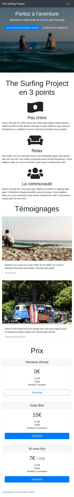
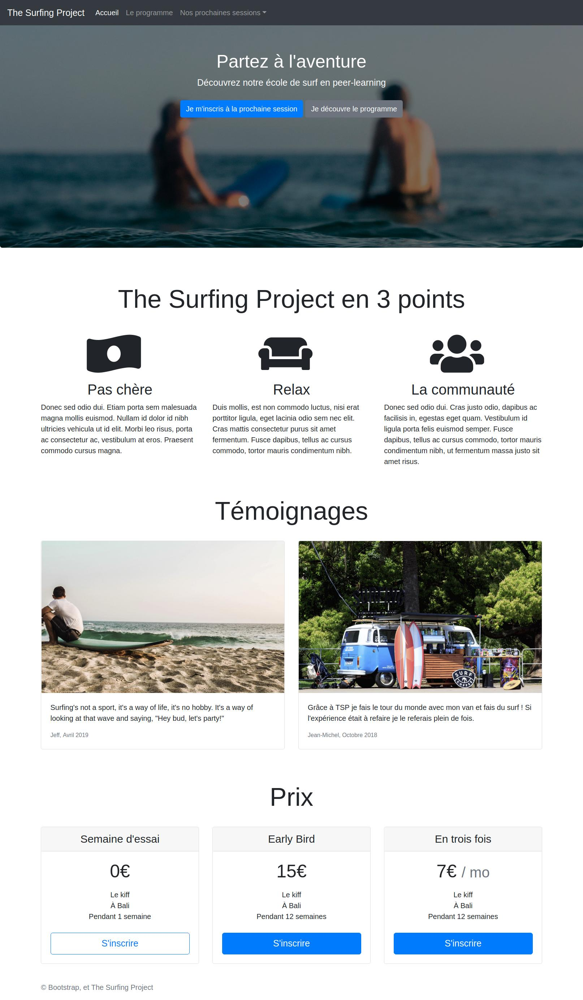

# Day 2: Learning CSS framwork: Bootstrap4

The project of today is using bootstrap to create a landing page: The Surfing Project.

This page must be reponsive and mobile first.

Demo at:

[https://tienduy-nguyen.github.io/thehackingproject/day4/index.html](https://tienduy-nguyen.github.io/thehackingproject/day4/index.html)

Here is 2 versions of project to do:

  <h2>Mobile version</h2>
  
    

  <h2>Desktop version</h2>
  

